Recent Changes - 1/12/2021
==========================

-   Over 870 algorithms – almost all less than a page of code.

-   The new “Best Of” module contains the best example of common techniques.
    Need an example of contours, look in the BestOf.vb first.

-   OpenCV’s new Oak-D camera has arrived. Some python scripts were added for
    users that have installed it.

    -   <https://docs.luxonis.com/en/latest/pages/api/> - to get the official
        support.

-   Motion detection is easier to use with an “AllRect” cv.rect that encompass
    all RGB changes.

-   Image segmentation is more stable and consistent from frame to frame. See
    ImageSeg.vb.

-   OptionsCommon.vb defines options common to all algorithms.

-   StructuredDepth shows promise as a path to exploiting structured light
    technology.

-   PythonDebug project is now integrated into the OpenCVB.sln. Python debugging
    is easier.

Introduction
============

There is no better documentation of an algorithm than a working example. Now
imagine over 800 OpenCV examples in a single app where each algorithm is less
than a page of code and is in a familiar language – C++, C\#, Python, or VB.Net.
And each algorithm is *just the algorithm* without the baggage from a user
interface. Each algorithm is reusable. New algorithms can reuse existing
algorithms to build variations and combinations.

In the sample output below, any of the algorithms can be selected from the first
combo box at the top of the form. The second combo box is used to select
algorithms grouped by OpenCV API or OpenCVB algorithm. The default grouping is
to select “\<All\>” algorithms while other special groupings allow selecting
Python or C++ algorithms.

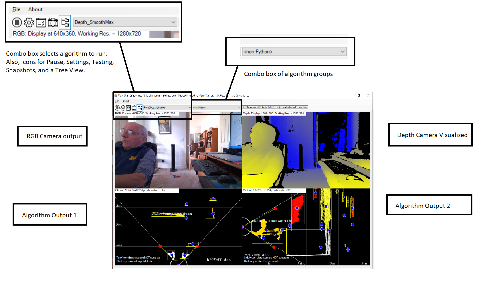

The output images above are the RGB output (upper left), the colorized depth
image (upper right), the output of the current algorithm (lower left) and an
optional second image output from the algorithm (lower right). In this example
the lower left image shows the point cloud as if seen from directly above. The
lower right views the same data from the side. Both perspectives show the camera
field of view (FOV) and a scale for the distance to each of the objects.

The “Sample Results” section below provides numerous additional examples.

Pre-Install Requirements
========================

Here are the requirements:

-   Windows 10

-   Visual Studio 2019 Community Edition (Free version of Visual Studio)

-   Any of the following RGBZ cameras:

    -   Microsoft Kinect for Azure

    -   Intel RealSense D435i

    -   StereoLabs ZED2

    -   Mynt Eye D 1000

    -   Intel RealSense D455 – the latest in the series of Intel RealSense
        cameras

All of the above cameras have an IMU (Inertial Measurement Unit.) The Microsoft
Kinect for Azure has the best depth accuracy but requires more power and is not
as portable as the Intel cameras. All the cameras use USB-C to provide data to
the host platform. A brief comparison of each camera is provided in Addendum 1.

The Objective
=============

The objective is to solve many small computer vision problems and do so in a way
that enables any of the solutions to be reused. The result is a toolkit for
solving ever bigger and more difficult problems. The philosophy behind this
approach is that human vision is not computationally intensive but is built on
many almost trivial algorithms working together. Is the combined effort of many
small operations what produces understanding? It make take years to answer that
question.

One key to this approach is each algorithm presents its own options
(sliders/check boxes/radio buttons/text boxes) for the different choices that
come with the algorithm. A property with a measure is at the root of every
concept.

OpenCVB is targeting only cameras that produce depth and color and have an IMU
to detect gravity and motion. These newer cameras have prompted a review of
existing vision algorithms to see how they can be improved if depth is known. To
enable revisiting many existing algorithms, this software provides a single
application that can run hundreds of OpenCV algorithms on any of the cameras
listed above.

There are many computer vision examples on the web but too often something is
missing. OpenCVB is designed to collect these algorithms into a single
application and guarantee that each will build and run. In addition, software
automation and aids simplify the process of adding variants and experiments.

The languages used are those often found in OpenCV projects - C++, C\#, Python
and even VB.Net. Secondly, it is important to get access to multiple libraries -
OpenCV, OpenCVSharp, OpenGL, Emgu, NumPy, NAudio, and OpenMP. And lastly, it is
important to enable all possible image representations - 3D, bitmaps, plots, bar
charts, spreadsheets, or text.

Making these languages and libraries available while using the same
infrastructure shaped a standardized class for OpenCVB algorithms. Implementing
hundreds of examples with the same reusable class structure has confirmed the
approach is useful. The result is a starting point to add depth and explore its
usage with OpenCV.

There are other objectives. Convolutions combined with neural nets (CNN’s) are a
successful approach to computer vision. CNN’s detect differences within a set of
images and identify content surprisingly well. OpenCVB is a pathway to search
for more and better features than convolutions, features that are measured,
objective, and essential. Depth, infrared, gravity, and camera motion are the
kind of objective features that can enhance almost any imaging algorithm.

And what if all cameras had depth and an IMU? Making this assumption explains
why only a few cameras from Intel, Microsoft, and others are currently
supported. The data from each camera – color, depth, point cloud, and IMU data -
is presented to all the algorithms in the same standardized format. More cameras
with depth are expected to arrive and integration with OpenCVB is likely to
follow. OpenCVB is an opportunity to experiment with the features of these
cameras and apply the same algorithm to all cameras.

The algorithms are notably short, almost always less than a page of code,
labelled reasonably well, easily searched, and easily combined, while often
providing links to online documentation and versions for other platforms. Many
downloadable algorithms are encumbered by environmental considerations that can
obscure the meaning or context of an algorithm. All the algorithms here contain
just the algorithm separate from any camera dependencies and will work with each
of the supported cameras. Isolating just the algorithm functionality enables
easy adaptation to other environments or platforms.

Pre-Install Notes
=================

You will need to download and install the following before starting:

-   Microsoft Visual Studio 2019 Community Edition (Free)

    -   OpenCVB works with any recent Visual Studio.

    -   Download: <https://visualstudio.microsoft.com/downloads/>

    -   Be sure to install the latest Python that comes with Visual Studio

-   CMAKE 3.0 or later

    -   <https://cmake.org/download/>

-   TortoiseGit and Git

    -   <https://tortoisegit.org/>

    -   <https://git-scm.com/downloads>

Installation – Quick Reference
==============================

This is the short description of install process:

-   Run the “PrepareTree.bat” script that comes with OpenCVB. It will download
    and run CMake for needed libraries. After building it will occupy about 18Gb
    of disk space – plan accordingly.

    -   This will take the majority of time for the install depending on the
        network speed.

    -   After “PrepareTree.bat” completes, Visual Studio projects will open. Run
        “Batch Build” and “Select All” in each Visual Studio project.

-   Set Environmental variable OpenCV_Version to 450. – This depends on the
    version of OpenCV, currently 4.50.

-   <https://docs.microsoft.com/en-us/azure/Kinect-dk/sensor-sdk-download> –
    Select “Windows Installer” to get proprietary Kinect4Azure support.

-   Build and run OpenCVB.sln – set OpenCVB as the “Startup Project”

Installation – Full Description with Discussion
===============================================

The installation of OpenCVB may seem formidable but it is automated to a high
degree – just click on “PrepareTree.bat” after downloading OpenCVB from GitHub.
The key to remember is that getting one example to work gets all the examples to
work.

The first step is to download OpenCVB from GitHub:

1.  <https://github.com/bobdavies2000/OpenCVB>

2.  Python should have been installed with Visual Studio. Only Python 3.x is
    supported.

3.  The third step is where all the work is.

    -   Run the “PrepareTree.bat” script in the OpenCVB directory.

>   The “PrepareTree.bat” script will download OpenCV, librealsense, and
>   Kinect4Azure from their respective GitHub locations and install them in the
>   OpenCVB tree. In addition, the script will run the CMake commands that setup
>   OpenCV, librealsense, and Kinect4Azure for OpenCVB’s use. The script will
>   then open Visual Studio for each solution file. Build the Debug and Release
>   versions of each with the “Build/Batch Build” Visual Studio menu entry. The
>   steps to download and run CMake take about 20 minutes depending on the speed
>   of the network connection. The Visual Studio builds may take an equal amount
>   of time depending on the speed of the machine.

1.  After all the packages have been built, then there is one environmental
    variable that needs to be set and it will depend on which version of OpenCV
    was just downloaded and built.

-   Environmental variable “OpenCV_Version” should be set to 450

-   The currently available OpenCV download is 4.50 so setting OpenCV_Version to
    450 reflects that but note that OpenCV is updated several times a year and
    the environmental variable may need to be updated.

1.  The last step before building OpenCVB is to download the proprietary
    binaries from Microsoft for their Kinect4Azure camera. The “PrepareTree.bat”
    script built the open source portion of the Kinect4Azure camera but this
    step will complete the installation of the Kinect4Azure camera:

    -   <https://docs.microsoft.com/en-us/azure/Kinect-dk/sensor-sdk-download>

    -   Click “Microsoft Installer” to download and install the proprietary
        Kinect code from Microsoft

2.  The last step is to open the OpenCVB.sln file and build OpenCVB.

    -   Support for some optional cameras can be easily added:

        -   For the StereoLabs ZED 2 camera (released Q1 2020), install the
            StereoLabs SDK from

        -   <https://www.stereolabs.com/>

        -   For the Mynt Eye D 1000 camera, download the SDK from:

        -   <https://mynt-eye-d-sdk.readthedocs.io/en/latest/sdk/install_win_exe.html>

    -   Edit “Cameras/CameraDefines.hpp” file to add OpenCVB’s support for
        StereoLabs Zed 2 or Mynt Eye D 1000 support.

Trouble-Shooting New Install
============================

Some typical problems with new installations:

-   Link problems: check the “OpenCV_Version” environmental variable for OpenCV
    version. It may need to reflect a newer version of OpenCV. For OpenCV 4.5,
    the environmental variable is OpenCV_Version = 450. Make sure that OpenCV
    Debug and Release versions were built successfully.

-   Camera Failure: check the camera installation by testing with examples
    provided by the camera vendor. Did the Kinect4Azure support get upgraded
    recently? Post if some configuration problems prevent the camera from
    working in OpenCVB.

-   Python Scripts Fail: this is likely a missing package. Run the algorithm
    “PythonPackages.py” in OpenCVB to verify that all the necessary packages are
    installed. If still failing, check the Python setting in the Options (click
    the Settings icon for OpenCVB.) Make sure it points to a Python 3.x version.
    Test Python scripts independently using \<OpenCVB Home
    Directory\>/VB_Classes/Python/PythonDebug.sln.

Build New Experiments
=====================

OpenCVB is a WinForms application and most of the algorithms were written using
Microsoft's managed code but C++ examples are provided as well - each with an
appropriate VB.Net wrapper. Python examples don’t require a VB.Net wrapper
unless you want to pass RGB, depth, or point cloud images to your Python script.
There are several VB.Net examples that demonstrate how to move images to Python
(see AddWeighted_Trackbar_PS.py as an example that is only a few lines of code.)

For C++, C\#, and VB.Net writing a new experiment requires a new class to be
added in the “VB_Classes” project. OpenCVB will automatically detect the new
class and present it in the user interface. The code is self-aware in this
regard – the UI_Generator project is invoked in a pre-compile step for the
VB_Classes project.

Code “snippets” are provided to accelerate development of new VB.Net, OpenGL,
and C++ algorithms. To use any snippets, first install them in Visual Studio:

-   Click the menu “Tools/Code Snippets Manager”

-   Select “Basic” as the Language.

-   Add the “\<OpenCVB Home Directory\>/OpenCVB.snippets” directory.

-   Access the code snippets with a right-click in the VB.Net code, select
    “Snippet/Insert Snippet” and select “OpenCVB.snippets”.

-   Even C++ algorithms can use snippets, but each C++ algorithm has a VB.Net
    entry that includes both the C++ and the VB.Net code in the snippet. The C++
    portion is to be cut and pasted anywhere in OpenCVB’s “CPP_Classes” Visual
    Studio project.

Experimental Subsets
====================

The complete list of algorithms may be grouped into smaller subsets to study
some shared OpenCV API reference or to switch quickly between algorithms.
Algorithm subsets may be created and accessed through the Subset Combo Box in
the toolbar (indicated below.) The list of subsets is built from all the OpenCVB
algorithm names and all the OpenCV API’s referenced. For instance, selecting
“Threshold” in the Subset Combo Box, will update the Algorithm Combo Box with
all the algorithms that use the OpenCV “Threshold” API.

*In the image above, all the algorithms using the “Edges_Sobel” class are listed
in the Algorithms Combo Box. The Select Subset combo box contains a subset
“\<All\>” that will allow access to the complete list of algorithms.*

The ability to create subsets from the hundreds of algorithms makes it easier to
study examples of an OpenCV API or OpenCVB algorithm usage. All the OpenCV API’s
that are used and all the OpenCVB algorithms are available in the list of
subsets. In addition, several higher-level groupings are available. For
instance, selecting “\<OpenGL\>” will select only the algorithms that use
OpenGL. The “\<All\>” entry in the Subset Combo Box will restore the complete
list of algorithms.

Regression Testing All Experiments
==================================

Testing is integrated into OpenCVB. Clicking the icon below runs through a
checklist of all the algorithms at all the resolutions with all the supported
cameras available on the system. The duration of each test can be selected in
the Options dialog.

When using a subset of the algorithms, the “Test All” button will test only the
algorithms in the subset. This can be useful when changing an algorithm that is
reused frequently by other algorithms. For instance, if the Edges_Sobel
algorithm is changed, first select the subset of all algorithms using
Edges_Sobel (the second combo box) then select “Test All” to visually review
each algorithm using the updated Edges_Sobel.

One side benefit of the “Test All” feature is that is provides a way to visually
review all the algorithms. When used in combination with the subset feature, it
can make it easier to search for a desired effect.

Why VB.Net?
===========

VB.Net is not a language associated with computer vision algorithms. But the
abundance of examples in OpenCVB suggests this may be an oversight. Even the
seasoned developer should recognize what is obvious to the beginner: VB.Net can
keep the code simple to read and write. Many papers and software articles will
often use something called “pseudo-code” to present an algorithm. In many
respects, VB.Net code often resembles pseudo-code except that it is an actual
working implementation of the algorithm.

VB.Net provides a full-featured language just like C\# with lambda functions and
multi-threading except VB.Net uses only a small subset of the keys available on
the standard keyboard. Contrasted with Python or C++, VB.Net need make no
apologies for using real keywords instead of the arbitrary meanings assigned to
all the special keys. VB.Net includes user interface tools that are flexible and
complete (check boxes, radio buttons, sliders, TrueType fonts, and much more) -
options missing from OpenCV's popular HighGUI library. (All existing HighGUI
interfaces are still supported in OpenCVB.)

The main caution in using VB.Net is to treat it as a scripting language like
Python. Most of the algorithms avoid pixel-by-pixel details – VB.Net can be
detailed but it will be slower than optimized C++. Usually, OpenCVB is doing
most of the real work in optimized C++ through the OpenCVSharp interface. Most
algorithms run reasonably fast even in Debug mode because the release version of
OpenCVSharp is active even when the solution is in Debug mode.

Critics will point out that a Windows 10 app using VB.Net is not easily portable
to other platforms but the entire OpenCVB application does not need to be ported
to other platforms. Only individual algorithms will need to be ported after they
are debugged and polished, Most algorithms consist almost entirely of OpenCV
APIs which are already available everywhere. OpenCVB’s value lies in the ability
to experiment and finish an OpenCV algorithm before even starting a port to a
different platform. Confining development to OpenCVB’s C++ interface should
provide the most portable version of any algorithm but even VB.Net code can be
ported to a variety of non-Windows platforms.

Camera Interface
================

All the camera code is isolated in the “camera” class – see cameraRS2.vb,
cameraKinect.vb, cameraMynt.vb, or cameraZed2.vb. There are no references to
camera interfaces anywhere else in the code. Isolating the camera support from
the algorithms strips the code to just the essential OpenCV API’s needed.

For example, the Kinect for Azure camera support is isolated to the
cameraKinect.vb class and a supporting Kinect4Azure DLL that provides all the
interface code to the Kinect for Azure libraries. Since there is likely to be
little interest in debugging the Kinect4Azure DLL, the Release version is used
even in the Debug configuration. If it is necessary to debug the camera
interface, set any Build Configuration components to the Debug version.
Optimizations enable a higher framerate than when running the Debug
configuration of the Kinect camera DLL. As a result, the VB.Net code in Debug
mode often runs as fast as the Release configuration.

OpenGL Interface
================

There have been several attempts to provide OpenGL interfaces into managed code,
but none is used here. OpenGL is simply run in a separate process. To
accommodate running separately, a named-pipe moves the image data to the
separate process and a memory-mapped file provides a control interface. The
result is both robust and economical leaving the OpenGL C++ code independent of
hardware specifics. The VB.Net code for the OpenGL interface is less than a page
and does not require much memory or CPU usage. The OpenGL C++ code provided with
OpenCVB is customized for specific applications in a format that should be
familiar to OpenGL developers. There are several examples – displaying RGB and
Depth, 3D histograms, 3D drawing, and IMU usage. A code snippet (See ‘Build New
Experiments’ above) provides everything needed to add a new OpenGL algorithm
that will consume RGB and a point cloud.

NOTE: it is easy to forget to include any new OpenGL project in the Project
Dependencies. This can be confusing because the new project will not build
automatically when restarting. The OpenCVB Project Dependencies need to be
updated whenever a new OpenGL application is added to the OpenCVB solution. To
update dependencies, select “Project/Dependencies” from the Visual Studio menu
and make sure that the “OpenCVB” project depends on any new OpenGL projects.
This ensures that the new project will always be rebuilt when OpenCVB is
restarted.

OpenCV’s OpenGL Interface
=========================

The “PrepareTree.bat” script will have configured OpenCV with OpenGL support.
OpenCVB can use this OpenGL interface – see the OpenCVGL algorithm. The
interface is sluggish and looks different from most OpenGL applications so the
alternative interface to OpenGL (discussed above) is preferred. Both interfaces
use the same sliders and options to control the OpenGL interface.

NOTE: why use sliders instead of OpenGL mouse or keyboard callbacks? The answer
in a single word is precision. It is often desirable to set appropriate defaults
with each of the numerous ways to change the display. Also, sliders were
valuable in learning which OpenGL API was controlling which feature of the 3D
effect. Preconfiguring the sliders allows the user to program a specific setup
for viewing 3D data.

OpenGL mouse and keyboard callbacks are also available. An example
“OpenGL_Callbacks” provides everything needed. The snippets for OpenCVB can
setup a new OpenGL example with callbacks as well.

Python Interface
================

OpenCV has numerous examples of Python scripts and Python is often used for
computer vision experiments. To add a new Python script for use with OpenCVB,
add a script in the Python directory of the VB_Classes project. It is convenient
for edits to add any script to the VB_Classes project but, more importantly, any
changes to a Python script will automatically show the new or renamed Python
files in the user interface. Python scripts don’t require a VB.Net wrapper –
just add them to the VB_Classes Project in the Python directory – and the script
will be present in the user interface.

Python scripts that need a stream of images from the camera should use the
“PyStream.py” import. There are numerous examples of how to do this: see
AddWeighted_Trackbar_PS.py or Camshift_PS.py. The “_PS” suffix is an OpenCVB
convention that indicates it is a Python Streaming script that expects a stream
of RGB and Depth images. NOTE: The Python script name MUST END WITH \_PS for
PyStream.py to work. To see the list of all the Python Streaming scripts, select
the pre-defined subset group called “\<PyStream\>”.

Python scripts show up in the list of algorithms in the OpenCVB user interface
and each Python script will be run when performing the regression tests. To
change which version of Python is used, open the “Options” dialog. In the
“Python” section, there is a browse button to select any Python.exe available on
the system.

Python Packages
===============

The Python libraries “opencv-python” or “NumPy” are required for many of the
OpenCVB Python scripts but are not installed by default. To update missing
packages in Visual Studio, use the “Tools/Python/Python Environments” in the
Visual Studio menu:

-   “Tools/Python/Python Environments” – select “Packages” in the combo box then
    enter “opencv-python” or “numpy” or any Python import and then select the
    package from the list.

To check that all the necessary packages are installed, run the
‘PythonPackages.py’ algorithm from OpenCVB’s user interface.

NumPy is included in the list of NuGet packages that come with OpenCVB but the
code has not been stable. Using Python as it is normally consumed – with Python
scripts running in their own process – means that the script will be reusable
elsewhere. There is a check box in the Global Options dialog box to allow new
versions of NumPy to be tested with the existing NumPy algorithms. Because it
has been unreliable, the enabled setting is not saved when OpenCVB is closed.

Python Debugging
================

Python scripts are run in a separate address space when invoked by OpenCVB just
like the OpenGL interface in OpenCVB. Visual Studio’s Python debug environment
is not available directly from OpenCVB. When a Python script fails in OpenCVB,
it may be debugged in the PythonDebug project. Here are the steps to debug
Python:

-   In OpenCVB, set the startup project as “PythonDebug”

-   Include the failing Python script in the PythonDebug project

-   Set the Python script that was just included as the “Startup File” in the
    PythonDebug Properties/General

Then running the PythonDebug project will test the Python script in the same
environment as if it were invoked from OpenCVB except the Python debugger will
be active and single-stepping through the script will be possible.

All OpenCVB Python scripts can be debugged with the PythonDebug project
including those that stream data from OpenCVB. For Python scripts requiring a
stream of images or point clouds, the process is reversed and the OpenCVB
executable is invoked automatically and run in a separate address space. Images
and point clouds can then be streamed to the Python script running in the
debugger.

Visual Studio C++ Debugging
===========================

The Visual Studio projects can be configured to simultaneously debug both
managed and unmanaged code seamlessly. The property “Enable Native Code
Debugging” for the managed projects controls whether C\# or VB.Net code will
step into C++ code while debugging. However, leaving that property enabled all
the time means that the OpenCVB will take longer to start – approximately 5
seconds vs. 3 seconds on a higher-end system. The default is to leave the
“Enable Native Code Debugging” property off so OpenCVB will load faster. Of
course, if there is a problem in the C++ code that is best handled with a debug
session, turn on the “Enable Native Code Debugging” property in the OpenCVB
VB.Net project and invoke the algorithm requiring C++ debugging.

Record and Playback
===================

The ability to record and playback is provided with OpenCVB – see the algorithms
labeled “Replay_Record” and “Replay_Play”. RGB, Depth, point cloud, and IMU data
are written to the recording file. Any algorithm that normally runs with the
live camera input and IMU data can be run with recorded data. Use the “Subset
Combo Box” to select the option: “\<All using recorded data\>”. Running the
regression tests with that setting will run all the algorithms with recorded
data instead of a live camera feed.

StereoLabs Zed 2 Support
========================

The StereoLabs Zed 2 camera is supported but the support is turned off by
default to simplify installation. To enable this support:

-   Download the StereoLabs SDK from
    <https://www.stereolabs.com/developers/release/>

-   Edit the CameraDefines.hpp file to turn on the interface to the Zed 2
    camera.

The Zed 2 camera support is always installed in C:\\Program Files (x86)\\ZED SDK
(regardless of the version) so no additional changes are required to the
supporting C++ project.

Mynt Eye D 1000 Support
=======================

The Mynt Eye D 1000 camera is supported but the support is turned off by default
to simplify installation. To enable this support:

-   Download the Mynt SDK from
    <https://mynt-eye-d-sdk.readthedocs.io/en/latest/sdk/install_win_exe.html>

-   Edit the CameraDefines.hpp file to turn on the interface to the Zed 2
    camera.

The Mynt D SDK creates a system environmental variable MYNTEYED_SDK_ROOT that
allows the OpenCVB build to locate the Mynt D camera support no matter where it
was installed.

Tree View
=========

The tree view shows how an algorithm was built using the other algorithms
present. Here is a simple algorithm tree view that shows how the Benford_JPEG
algorithm was built:

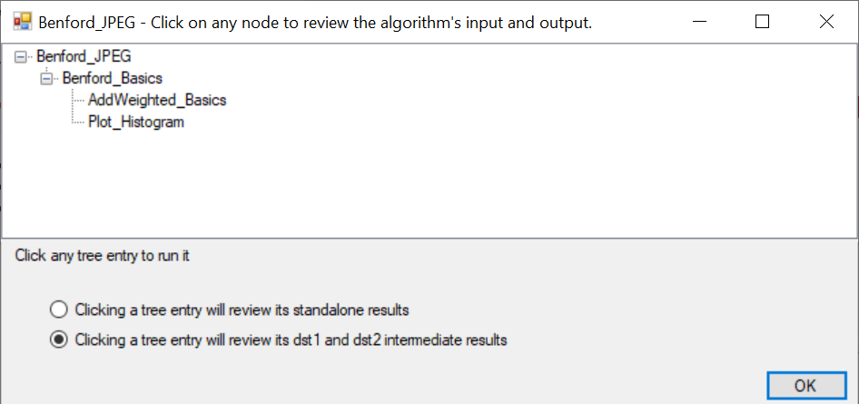

The Benford_JPEG algorithm applies the “Benford_Basics” algorithm to a JPEG
image data. The “Benford_Basics” algorithm builds a histogram. The histogram is
then displayed using OpenCV’s “AddWeighted_Basics” API and a histogram plot
algorithm called “Plot_Histogram”.

Note the pair of radio buttons below the tree view. The tree view is “live” in
the sense that clicking on any entry in the view will show one of 2 different
outputs in the main OpenCVB form: 1) the output of the clicked algorithm’s
“standalone” run; or 2) the output of the currently running algorithm. The
objective is to show and understand the intermediate stages of the different
algorithms that comprise the current one that is running. All output will show
up in OpenCVB’s main form in the bottom 2 images.

VTK Support
===========

It takes some time to get VTK (the Visualization Took Kit) working with OpenCV.
These instructions to install VTK are here:

<https://vtk.org/Wiki/VTK/Configure_and_Build>

Some notes on preparing VTK for use with OpenCV and OpenCVB:

-   Run OpenCVB’s “Support/PrepareVTK.bat” file to download and prepare the VTK
    directory.

    -   Visual Studio will open the VTK.sln file. Select “Build/Batch Build” and
        “Select All” to build VTK

-   Close Visual Studio and run Visual Studio as Administrator, click on the
    INSTALL Project and select Build

    -   Upon completion of the Build Install, c:\\Program Files\\VTK should
        contain VTK.

-   Open CMake for OpenCV and run Configure/Generate and then build the OpenCV
    project

    -   Make sure that the VTK_DIR points to where VTK was installed
        (c:\\Program Files\\VTK)

-   Validate that VTK was correctly installed by looking at the
    OpenCVB/opencv/Build/Bin/Debug

    -   And make sure that the opencv_viz\* dll’s are present

-   In OpenCVB’s VTKDataExample, open the VTK.h file and uncomment the first
    line “\#define WITH_VTK”

    -   Rebuild OpenCVB and the VTK algorithms will run (they all start with
        “VTK”)

Release vs. Beta
================

There are no release versions of OpenCVB. The infrastructure for OpenCVB – see
the OpenCVB project – is stable and likely to just be tweaked with support for
new cameras. The objective is continuing development of algorithms where each
algorithm is independent. New algorithms are tested thoroughly before being
added but even if a new algorithm fails, the vast majority of algorithms will
continue to work. All algorithms are subject to continual overnight testing that
should highlight deficiencies in any algorithm run with default settings. The
plan is that release is beta and beta is release – there will be no distinction
– and any download will work.

How to Contribute
=================

Adding more examples is the goal and that is the best way to contribute to this
effort. There are plenty of examples to use as a model but there are also
snippets that assist in the process of adding new examples. Any pull request
that adds an algorithm will be welcome and quickly reviewed. Changes to the
OpenCVB infrastructure – not the algorithms – is discouraged but always welcome.
(See previous section on “Release vs. Beta” to understand why.)

Sample Results
==============

The following images are a preview of some algorithms’ output.

In the OpenCVB user interface, the top left image is the RGB and top right is
depth. Algorithm results are in the bottom left and right or additional OpenGL,
Python, or HighGUI windows.

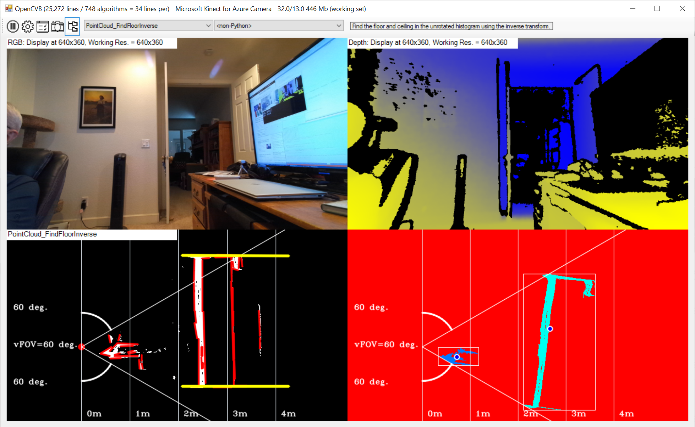

*The bottom left is a side-view of the depth data that has been rotated using
the IMU gravity vector. The rotation facilitates finding the 2 horizontal yellow
lines in the bottom left image that identify the floor and ceiling in the image.
If the floor or ceiling is not visible, the yellow lines are not shown. The
bottom right image is the same side-view of the depth data before it was rotated
with the IMU gravity vector.*

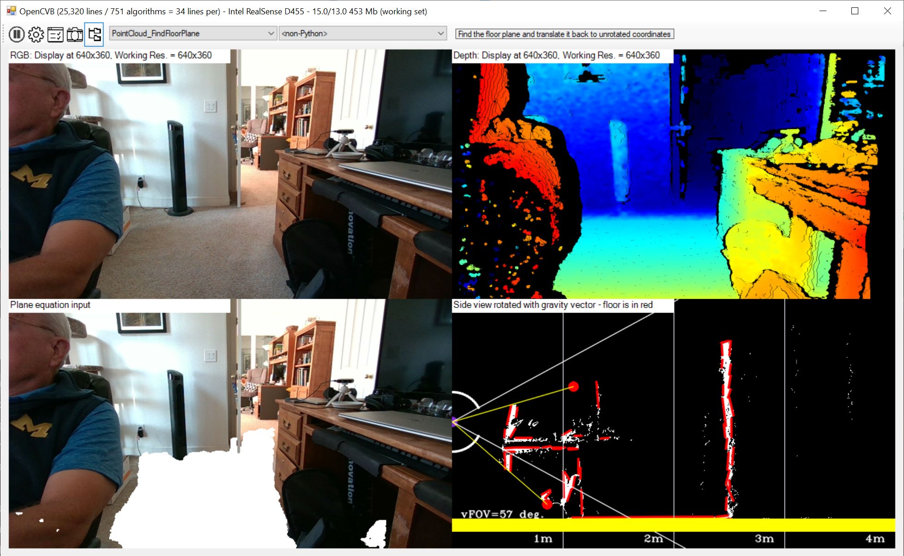

*The bottom left highlights the floor that has been determined from the depth.
The bottom right image shows side view with the line detector output in red. The
yellow bar is the consolidation of all the lines that outline the floor. The
white in the bottom left is the plane the yellow bar depicts projected into the
image coordinates.*

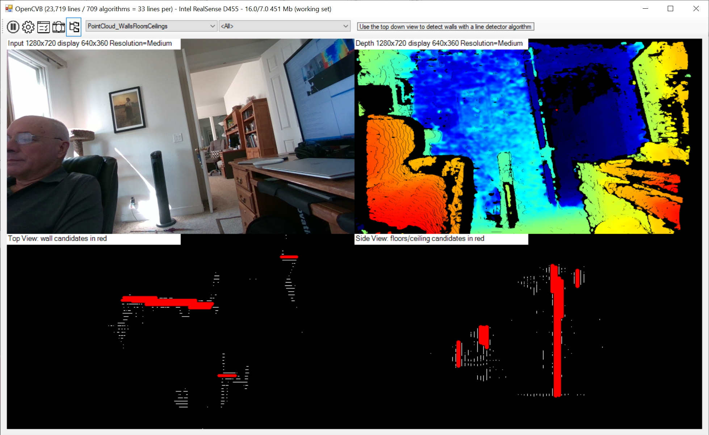

*The bottom left is a top-down view of the point cloud data for an Intel D455
camera while the bottom right is a side view of the same point cloud. The red
lines indicate where walls were detected. A slider controls the expected minimum
length of a detected wall. The images are actually histograms of point cloud
data after aligning the point cloud with gravity from the IMU on the D455
camera.*

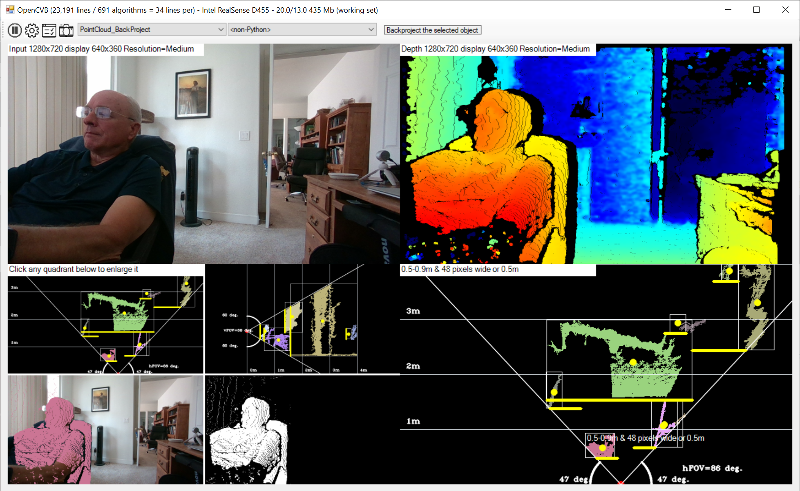

*OpenGL has an infinite number of ways to view a point cloud but visualizing top
down and side views are the most satisfying complements to the image view. The
“PointCloud_Backproject” algorithm uses the IMU to produced both a top down view
and a side view. Clicking on an object will back project that object into the
color image in the lower left corner. A mask for the object is also shown. The
aspect ratio of both top and side views is 1:1 to provide realistic dimensions
and linear edges. The camera is identified with a red dot.*

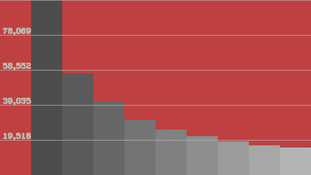

*Benford’s Law is an interesting empirical hypothesis. The plot above is
actually 2 plots – a count of the leading digits pulled from a compressed image
combined with a plot of the expected distribution of those leading digits
derived from Benford’s Law. The values are so close that you cannot see the
difference. The code contains some links explaining Benford’s Law and examples
of when it works and when it does not.*

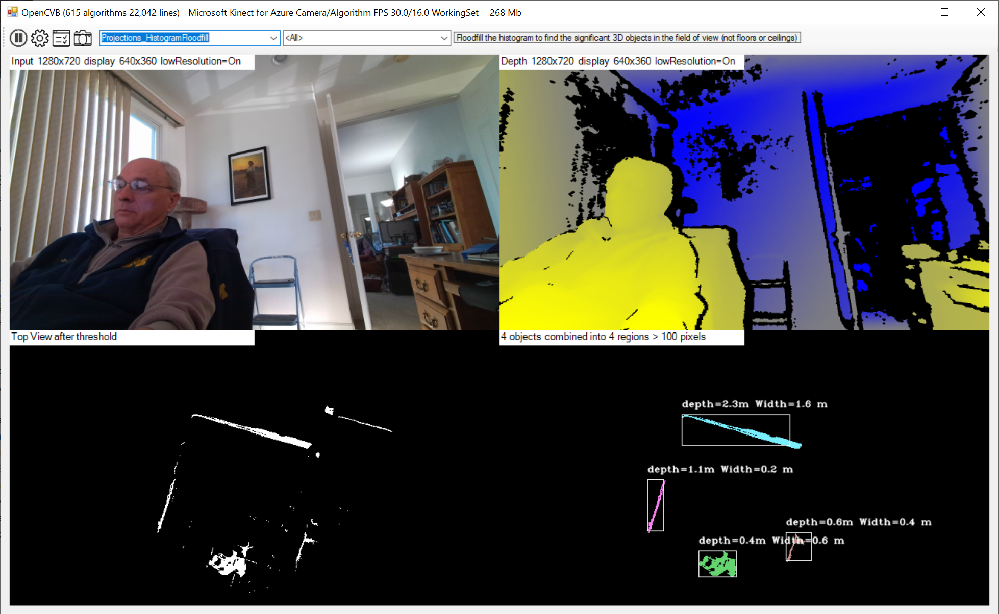

*The top down view – after thresholding - is a slice through the vertical
objects in the field of view. Each object can be isolated with a floodfill to
find size and distance.*

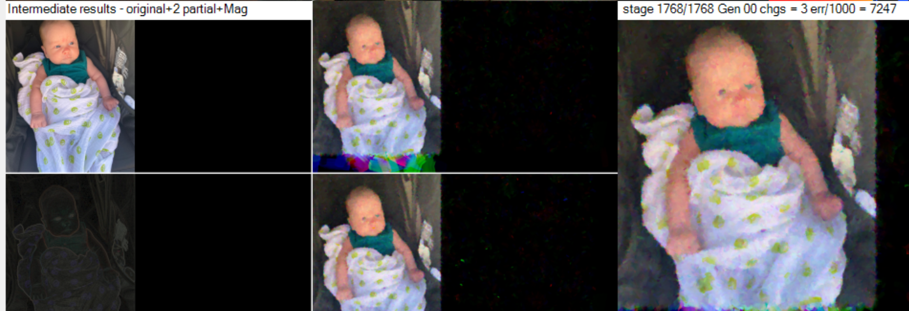

*A genetic drawing experiment that translates any image or camera screen grab
into a painting. The algorithm randomly alters DNA sequences describing brush
strokes.*

*Histogram Valleys are used to create clusters in depth data. The bottom left is
the histogram showing the different clusters. The bottom right is the
back-projection of the different clusters into the depth image using the same
colors as the histogram.*

*Using the histogram to create clusters (see previous example ‘Histogram
Valleys’) allows an algorithm to segment an entire image (see lower right
image), creating blobs that can be measured and tracked. The black segments have
no depth. The number of blobs can be controlled with a lower limit on the size
of the blob.*

*The IMU timestamp provides clues to the relationship between the IMU capture
and the image capture (the devices are on different clocks.) The image capture
triggers an interrupt but how long ago did the IMU capture the pose data or
Gyro/Acceleration? The plot in the lower right shows the actual frame durations
for the IMU and host interrupts following an image capture. The IMU and host
interrupt frame times are used to estimate the delay from the IMU capture to the
image capture. The blue dots are the actual IMU capture frame times, the green
is the host image capture frame time, and the red is the estimated delay from
the IMU capture to the image capture. The white row shows the IMU frame time
with the highest occurrence and is used as a boundary between lost IMU captures
(below the white line) and correctly sequenced IMU captures (at or above the
white line).*

*Here the MeanShift algorithm is used to track the 4 largest blobs in the image.
The lower left image shows the objects tracked by the algorithm while the lower
right shows the different histograms used to identify the object to track. The
histogram is for the hue portion of the HSV format of the image.*

*KAZE feature detection algorithm matching points on the left and right infrared
images from the Intel RealSense 3D camera.*

*The features detected by the FAST (Features from Accelerated Segment Test)
algorithm are shown with 2 different FAST options.*

*This is a combination of 4 variations of binarization and their corresponding
histograms. It demonstrates the use of the Mat_4to1 class to get 4 images in
each of the result images.*

*A Kalman filter is used here to follow the mouse. The actual mouse movement is
in red while the output of the Kalman filter is in white.*

*Compare the original color and depth images with the image right below it to
see the impact of an edge-preserving filter applied to both.*

*The bottom images are the output of a multi-threaded Hough lines algorithm that
identifies featureless RGB surfaces (shown as white in the lower right image).
The blue color in the lower right image is meant to highlight depth shadow where
no depth data is available.*

*The MeanShift algorithm output (lower left) is used here to find what is likely
to be the face – the highest point of the nearest depth fields (shown in a box
in the lower right.)*

*Algorithms may optionally work on only a selected region. Here the oil paint
effect is applied only to the region selected by drawing a rectangle on the
output image (lower left.) The lower right image is an intermediate stage with
only edges. All algorithms may draw a rectangle with a right-mouse to open a
spreadsheet with the data selected in the rectangle.*

*The OpenGL window is controlled from the VB.Net user interface but is run in a
separate address space. The OpenGL axes are represented in this image as well.
In the lower left background are some of the sliders used to control the OpenGL
interface – Point Size, FOV, yaw, pitch, roll.*

*This dnn Caffe example in VB.Net is a reinterpretation of the C++ sample
program distributed with the Intel librealsense library. The application is
meant to detect and highlight different objects shown in the yellow box (lower
right). The algorithm requires square input (shown centered in the lower left
image.)*

*This example of a compound class shows an image that has been motion-blurred
(lower left) and then de-blurred in the lower right. The options for the motion
blur and de-blur are also shown.*

*It is an option to use VTK (Visualization Tool Kit) but it is turned off by
default in the distribution. The test pattern in the lower right image behind
the VTK output is sent to VTK where the 3D histogram is computed and displayed.*

*The Expectation Maximization algorithm learns the different clusters and then
predicts the boundaries of those clusters. The lower left image defines the
different clusters (each with a different color) and the lower right fills in
the maximized regions for each cluster. The RGB and Depth images are not used in
this example.*

*In this example of multi-threaded simulated annealing, the lower right image
shows 4 annealing solutions - the 2 best solutions with 2 worst solutions. The
log in the bottom left shows each thread getting different energy levels,
confirming that each is independently searching the solution space. The example
was taken directly from the OpenCV examples but was multi-threaded on an Intel
Core i9 18-core (36 thread) processor here*.

*First, two estimated triangles are created to surround two sets of random
points. Then an affine transform is computed that converts one triangle to the
other. The matrix of the computed affine transform is shown of the lower right
image. The RGB and depth images are not used for this algorithm.*

*First, a randomly oriented rectangle is created. Then a transformation matrix
is computed to change the shape and orientation of the color image to the new
perspective. The matrix of the computed affine transformation is shown in the
lower right image.*

*The histograms displayed in OpenCVB have an option to use Kalman filtering to
smooth the presentation of the bar graph (lower right.) A check box (below the
bar graph) allows alternating between a Kalman-smoothed and real-time bar graph.
The bar colors show a progression of dark to light to link the color of the
underlying grayscale pixel into the bar graph. There is also an option to use
different transition matrices in the Kalman filter.*

*This example shows the Plot_Basics class which will plot XY values. The bottom
left image shows the mean values for red, green, and blue in the color image
smoothed using Kalman prediction while the bottom right shows the real-time
values.*

*In the OpenCV distribution there is a bio-inspired model of the human retina.
The objective is to enhance the range of colors present in an image. In this
example the “useLogSampling” is enabled and emphasizes colors (bottom left) and
motion (bottom right).*

*Applying the bio-inspired enhancements, the high-dynamic range image is shown
in the bottom left while the motion-enhanced image is shown in the bottom right.
The monitor on the desk that appears black in the image in the top left has much
more detail in the bottom left image which shows the reflection that would
likely be visible to the human retina.*

*In this Python example taken from the OpenCV distribution, the various
positions of an etalon (not shown) are visualized in a 3D matplotlib control.
See the “Camera_calibration_show_extrinsics.py” algorithm.*

*In this multi-threaded version of the Gabor filter, the bottom left image is
the Gabor result while the bottom right figure shows the 32 Gabor kernels used
to produce the result on the bottom left.*

*Emgu applications are supported as well. Here the planar subdivision of the
image is shown for a random set of points with Voronoi facets and Delauney
triangles. Emgu interfaces, while based on OpenCV, are significantly different
from OpenCVSharp. For instance, the Emgu Mat is not the same as the OpenCVSharp
Mat. Nonetheless, there is considerable ongoing investment in the Emgu APIs’ and
they are fully supported.*

*The Aruco markers are found in an image allowing the image to be transformed
using OpenCV’s WarpPerspective transform. This example is from the OpenCVSharp
Sample programs.*

*OpenCV can be used to display audio data using the NAudio package from NuGet.
The interface can play any available audio data or generate synthetic sound in a
variety of patterns – pink/white noise, square waves, sawtooth waves, etc. The
black vertical bar shows tracks the currently playing sound.*

*This synthetic problem demonstrates how to use the Python SciKit package to
perform a gradient descent problem.*

*A voxel-style view of the depth data in OpenGL is available – see top window.
The bottom left shows the thread grid used to compute the median depth in each
voxel while the bottom right shows the voxels colored with their median depth
(using the typical colors for depth – yellow for close, blue for distant.) The
options used in each of the contributing algorithms are present below the main
OpenCVB window (not shown.)*

*Support for Intel’s T265 is rudimentary – it is not meant to capture depth and
the camera is grayscale. The upper left image is the undistorted and remapped
Left View. The upper right color section shows depth (computed on the host)
while the rest of the image is the Left View. The bottom views are the left and
right raw camera views (cropped to accommodate the frame size.) While none of
the algorithms fail when running the T265, not all of them produce anything
useful as depth is not provided by the camera.*

*OpenCV’s InitUndistortRectifyMat and Remap API’s can be used to manipulate the
image arbitrarily. Here one of the sliders in the interface has introduced
barrel distortion in the lower left image. This is a useful exercise to get an
more intuitive understanding of the parameters needed to rectify and undistort
an image.*

*The 100 year-old photos of Prokudin-Gorskii were made with red, green, and blue
filters. Combining the 3 images is a useful application of the OpenCV
findTransformECC API that can align the images. One of the transformation
matrices is displayed as well. The option to use gradients for alignment
(instead of RGB values) is available. There are 4 possible OpenCV parameters to
define the extent of the search for alignment in the user interface.*

Future Work
===========

The plan is to continue adding more algorithms. There are numerous published
algorithms on the web but there is also the task to combine the different
algorithms in OpenCVB. The current edition of the code contains examples of
compound algorithms and more will arrive in future releases. The code almost
enforces reuse because any algorithm with sliders or check boxes encourages
reuse rather than duplicate a similar set of sliders and check boxes. The
options for combined algorithms are automatically cascaded for easy selection.

Acknowledgements
================

The list of people who have made OpenCVB possible is long but starts with the
OpenCV contributors – particularly, Gary Bradski, Victor Erukhimov, and Vadim
Pisarevsky - and Intel’s decision to contribute the code to the open source
community. Also, this code would not exist without OpenCVSharp’s managed code
interface to OpenCV provided by user “shimat”. There is a further Intel
contribution to this software in the form of RealSense cameras – low-cost 3D
cameras for the maker community as well as robotics developers and others.
RealSense developers Sterling Orsten and Leo Keselman were helpful in educating
this author. While others may disagree, there is no better platform than the one
provided by Microsoft Visual Studio and VB.Net. And Microsoft’s Kinect for Azure
camera is a valuable addition to the 3D camera effort. And lastly, it should be
obvious that Google’s contribution to this effort was invaluable. Thanks to all
the computer vision developers who posted algorithms where Google could find
them. From this author’s perspective, the work of all these organizations is
like catnip and feathers to a kitten.

MIT License
===========

<https://opensource.org/licenses/mit-license.php> - explicit license statement

Fremont, California

Fall 2020

Addendum 1: Comparing Cameras
=============================

There are 5 supported cameras that generate a point cloud – Intel RealSense
D435i, Intel RealSense L515, Microsoft Kinect4Azure, StereoLabs Zed 2, and Mynt
Eye D1000. The cameras are setup to measure the distance to the same wall in the
same environment. Here is a look at how the cameras were setup:

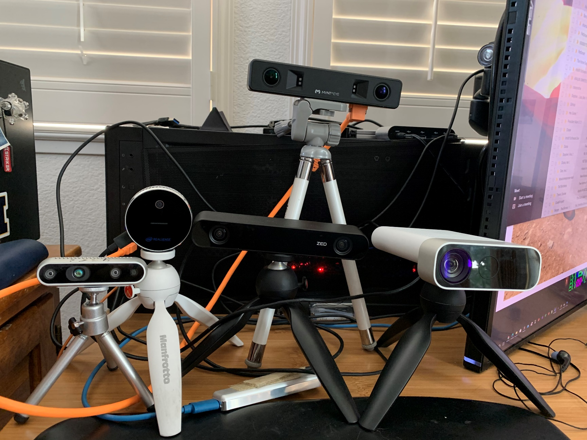

The cast of characters – (left to right) Intel D435i, Intel L515, StereoLabs Zed
2, Mynt Eye D1000, and Microsoft Kinect 4 Azure. Using the
“PointCloud_GVector_TopView”, all the above cameras were used to measure the
distance to the wall approximately 2.5 meters from the cameras. The results are
below. Not shown above is the latest Intel RealSense camera – the D455. The
output is shown below and looks good.

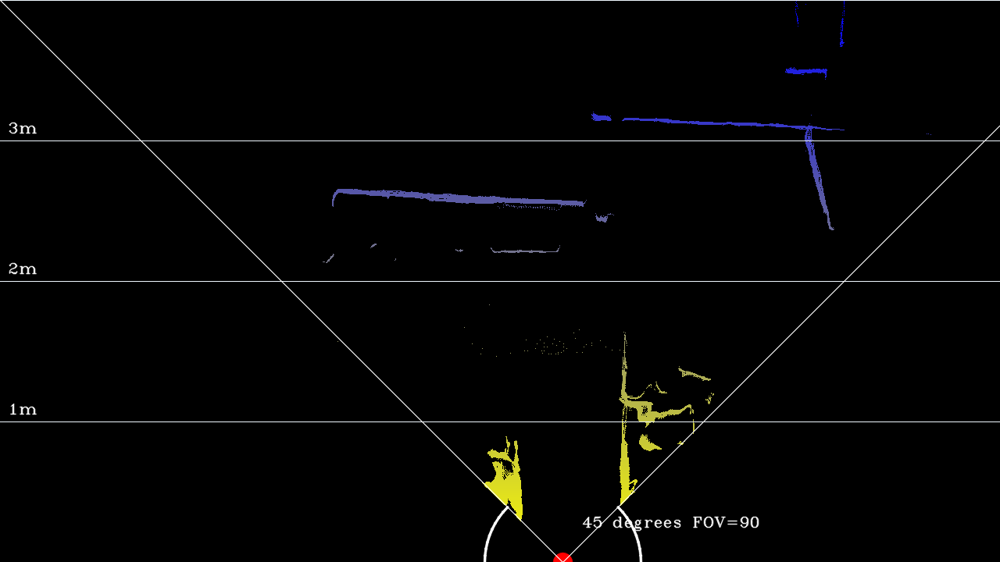

Microsoft Kinect 4 Azure results – these were the best results.

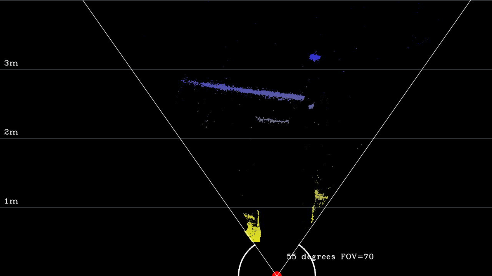

Intel Realsense L515 Lidar camera

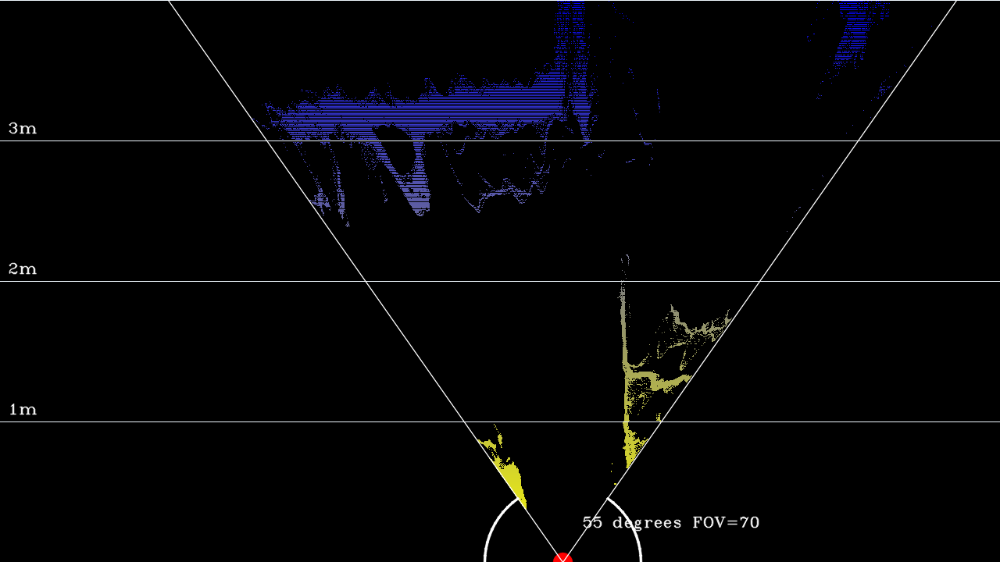

Intel RealSense D435i camera. (Distance to the wall looks incorrect.)

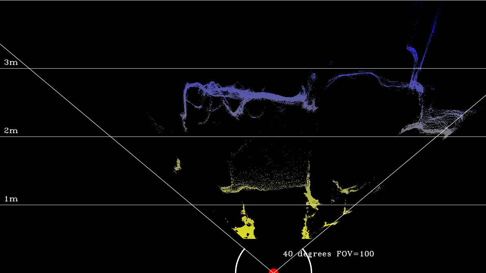

StereoLabs Zed 2 camera. FOV looks a little skewed to the right. The problem
could be specific to this camera but there was no available second camera to
test (the camera is a little expensive.)

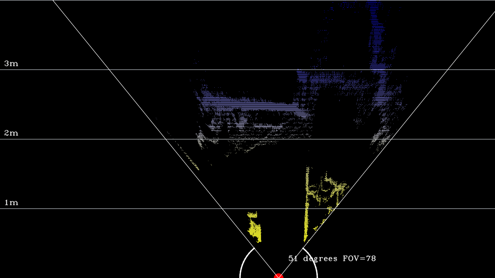

Mynt Eye D 1000 camera.

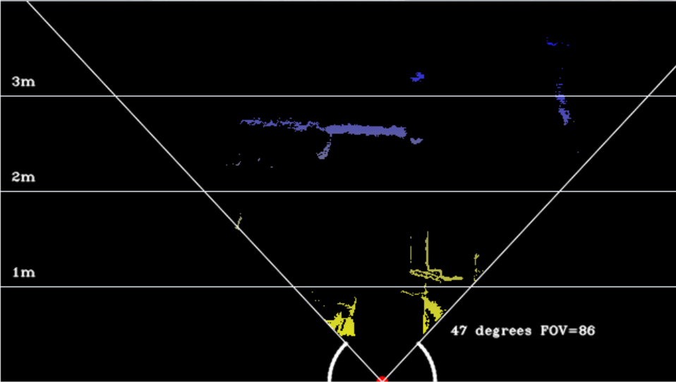

Intel RealSense D455 camera.

Addendum 2: Some Thoughts
=========================

1.  The user interface is the documentation. The user interface should make it
    clear how the algorithm works and what parameters will tweak it. Not all
    algorithms live up to this standard but many do.

2.  There are few comments in the code. Documenting code is a second, parallel
    explanation of the algorithm and too often it is not managed. All algorithms
    are short and can be stepped through with a debugger. There are rare
    comments but they explain settings or assumptions not explicitly in the
    code. In common practice elsewhere, code comments are padded with spaces and
    too often out-of-date. Automated comments are a waste of screen space. Room
    for improvement: allow images in the code. An algorithm’s output can go a
    long way toward explaining the algorithm.

3.  Sliders and checkboxes are located by the text for the slider or checkbox,
    not by the name of some variable. The user interface is the documentation –
    see Thought \#1. If the text in the user interface changes and the slider or
    checkbox is not found, an error will appear in the regression tests
    describing the missing label and the name of the failing algorithm.

4.  All algorithms are run through a regression test with a single click.
    Algorithms can still fail when sliders or settings are changed but every
    effort is made to test with abrupt and reckless changes to the settings.
    Room for improvement: test combinations of settings automatically.

5.  Each algorithm is short. The caption of the user interface (at the top)
    contains the average number of lines – currently around 35 lines per
    algorithm. Short algorithms are easier to write and test. Short algorithms
    may be easily rewritten in another language.

6.  Algorithms should run standalone. This enables testing and isolates
    problems. The “standalone” variable is available to all algorithms to
    control behavior when running by itself or as a companion to another
    algorithm.

7.  Every algorithm is designed for reuse by other algorithms. Each algorithm
    has at least one source (labeled src) and 2 default destinations (labeled
    dst1 and dst2). Any additional inputs or outputs are made available with
    public variables in the algorithm’s object.

8.  Camera interfaces are run in their own task and are always running and
    presented in the user interface whether the data is consumed or not. Without
    the camera updates to the screen, a long-running algorithm looks like a hung
    system.

9.  Cameras are always run at 1280x720 or 640x480. Room for improvement: support
    a full camera interface with different resolutions and settings (a lot of
    work given the number of supported cameras.)

10. The user interface is the main task. The camera task is independent of the
    user interface. The algorithm is run in its own task as well.

11. All threads are labeled so they are visible in the debugger in the “Threads”
    display. The algorithm will wait on camera data if camera frame rate does
    not keep up but most often, the next camera buffers are ready as soon as the
    algorithm finishes the current set of buffers.

12. Algorithm groupings are subsets organized by specific OpenCV and OpenCVB
    API’s or objects. Changes made to an OpenCVB algorithm can be easily
    validated by selecting the group of algorithms that use the OpenCVB
    algorithm and running the regression test on that subset. That was the
    motivation behind grouping algorithms although other uses are interesting
    (such as searching for examples of OpenCV API’s – see next Thought)

13. OpenCV API’s can always be found with an editor but selecting an OpenCV API
    group will show how each algorithm uses the OpenCV API.

14. Every time that OpenCVB is compiled, the groupings are reset just like the
    list of algorithms (see next Thought.)

15. Every time OpenCVB is compiled, the list of all algorithms is created and
    provided to the user interface. The user interface is aware of the code used
    to create the user interface.

16. The last algorithm to execute is automatically run when starting OpenCVB.
    There is only a “Pause” button, no “Stop” button. When developing,
    commenting out code or renaming the algorithm will allow work to continue
    and OpenCVB to come back up. When the last algorithm is not found, the first
    algorithm in the algorithm list is run.

17. Regression tests run every algorithm with each available camera at the
    highest resolution. Setting the algorithm group to “\<All\>” can repeatedly
    run the list of algorithms 10’s of thousands of times without incident.

18. Some algorithms can run for long durations. Not a problem normally but it
    was a problem for the regression tests when algorithm B is started before
    algorithm A is finished. This was fixed with Synclock around the algorithm
    thread – only one algorithm can run at a time. Algorithm B waits until
    algorithm A completes and relinquishes the lock. However, in extreme cases,
    the queue of tasks waiting for the synclock may grow and lag the displayed
    algorithm.

19. Options for each algorithm are presented by the algorithm itself and are
    automatically part of the algorithm task. A Multiple-Document Interface

    1.  window shows all the options in a single window as cascading windows.
        The sliders (or trackbars) are on the left side of the MDI window while
        checkboxes and radio buttons are on the right.

20. With multiple tasks for camera, user interface, and algorithm, there is no
    guarantee that all 4 images are for the same instant. However, the left and
    right destination images are for the same iteration. Room for improvement:
    sync the presentation of the RGB and RGB Depth images like the dst1 and dst2
    images.

Addendum 3: Log of Recent Changes
=================================

Recent Changes 9/15/2020:
=========================

-   Dropped support for Intel T265 camera (no point cloud) and the Intel
    RealSense L515 (no IMU). All supported cameras have a point cloud and IMU.

-   Tree view – some of the algorithms are a combination of several other
    algorithms. A tree view was built to display the hierarchy.

-   There are now over 750 algorithms implemented.

Recent Changes - 12/12/2020
===========================

-   Over 800 algorithms – almost all less than a page of code.

-   Depth updates are guided by motion – produces more stable 3D images. See
    Depth_SmoothMin algorithm.

-   Recently used algorithms are listed in the menus.

-   More snippets to help adding options to existing algorithms.

-   Algorithm options are now collected in a single form – easier usage on
    laptops or smaller screens.

-   Intel Realsense cameras are supported in native 640x480 modes (as well as
    1280x720.)
